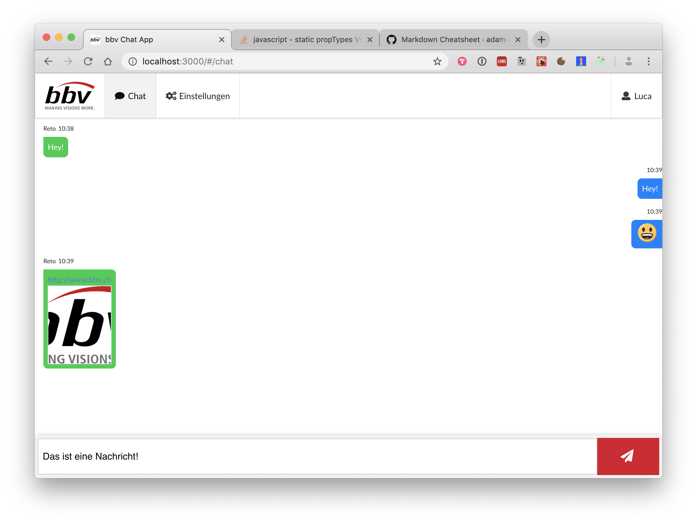
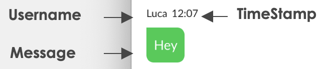

#Einführung in React

##Übung 1 - Basics
### Komponente 1 – Komponentenbasierte Komposition im Container

Für die Chat-App gibt es bereits diverse wiederverwendbare Komponenten. Damit die ChatApp angezeigt werden kann, muss aber noch im Ordner src/pages ein Container (technisch auch eine Komponente) namens "ChatPage" erstellt werden.

Darin sollen Komponenten ChatArea & MessageSender angezeigt werden. Als Wrapper soll der src/pages/StyledPageContainer verwendet werden (entsprich einem html-div).

Damit die neue Seite auch angezeigt wird, muss der AppRouter (src/navigation/AppRouter) & die Navigation (src/navigation/Navigation) angepasst werden. Startseite nicht vergessen.




###Komponente 2 - wiederverwendbare Message-Bubble


In dieser Aufgabe soll eine wiederwerwendbare Komponente src/components/Message entstehen.
Diese Komponente ist selber eine Komposition aus einem oberen Teil bestehend aus Benutzername & Timestamp und dem unteren Teil, der die Bubble repräsentiert.

Übersicht Komponenten:

- Zeit: src/components/TimeStamp 
-- Props: "value" (entspricht messages.time)
-- Props: "floatToRight" (entspricht message.type === "sent")

- Benutzername: src/components/Username
-- Props: "value" (entspricht messages.from)

- MessageBubble: src/components/StyledMessage
-- Props: "type" (entspricht messages.type)

Der Inhalt der Nachricht kann über message.content abgerufen werden.

Die neue Komponente Message soll im render ein React.Fragment zurückgeben.

Die Komponenten TimeStamp & Username sollen innerhalb eines Div gewrappt werden: ```<div id="username-container">```
StylesMessage ist mit dem div zusammen direkt dem Fragment untergeordnet.

####Binding einer Methode an die Komponente
Im der Komponente soll eine neue Methode namens "parseURLs(text)" erstellt werden. Diese Methode nimmt den Nachrichten Inhalt und wandelt alle URLs in HTML-Links um. Der Fokus dieser Aufgabe liegt im korrekten Anwenden der unterschiedlichen Binding-Strategien (siehe Präsentation Folie X). Der Code der Methode selbst ist sehr spezifisch und kann nachfolgend kopiert werden.

```javascript
const urls = getUrls(text);
    if (!urls.size) {
      return;
    }
    const parsedUrls = Array.from(urls).map((url, idx) => (
      <MicrolinkCard url={url} key={idx} />
    ));
    return <React.Fragment>{parsedUrls}</React.Fragment>;
```
####PropTypes definieren
Für das Prop "message" sollen PropTypes definiert werden, damit wir TypeSafe unterwegs sind.
(siehe Folie 49)

####Bonus (für die Schnellen)
Emojify & Link-Unterstützung: Der konkrete Inhalt der Message (content) kann mittels den Librariers Linkify & Emojify ergänzt werden, sodass Nachrichten wie in den folgenden Bildern möglich sind.

###Komponente 3 - Bonusaufgabe UnreadMessageCounter
